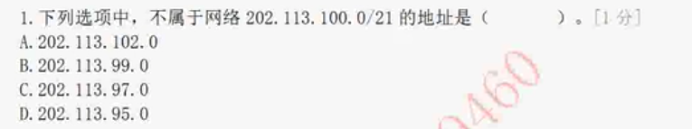
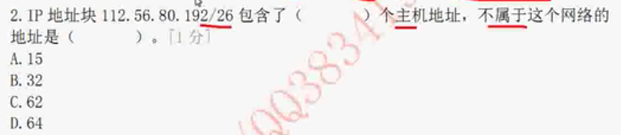
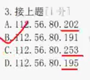
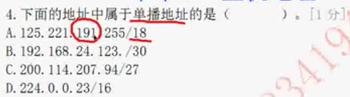
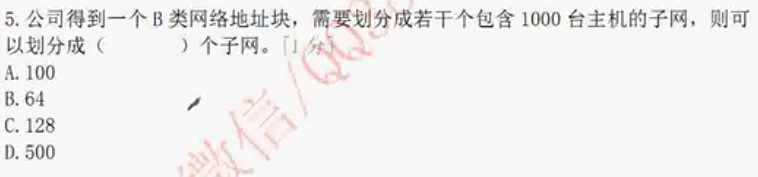

# 中级网络工程师 1711

## 子网掩码

求可用ip的范围，主要是确定子网的范围，和8的倍数有关系

### 确定倍数的方法

21 在 3*8里面

25 在 4*8 里面

### 第一种8421法

24 - 21 = 3 （最大是24，差值就是2的倍数，用来确定多少IP为一个单位）

2^3 = 8 （2是每个ip的基数，用来确定）

（0 - 7） （8 - 15） （16 - 23）

### 第二种直接除8，用来确定ip的范围的倍数

24 - 21 = 3 （最大是24，差值就是2的倍数，用来确定多少IP为一个单位）

2^3 = 8 （2是每个ip的基数，用来确定ip地址分配单元）

**26**在第四段

**注意主机地址一头一尾不能给主机分配，一个是广播号，一个是网络号**

32 - 26 = 8是ip地址目前的分配单位的倍数

2^8 = 64 故一个ip地址分配单元为64位

故ip地址分配单元位（0 - 63）... (192-225) 起始地址位192

故191不在ip地址段里面

## 单播地址（单个ip 主机地址）

A: 24 - 18 = 6   2^6 = 64 故ip地址段为(0-63   64-127   128-191   192-255) 128.0 ~ 191.255

B: 32 - 30 = 2   2^2 = 4 故ip地址段为(0-4   ...   120-123)  120~123 123为广播地址

C: 32 - 27 = 7 2^5 = 32 故ip地址段为(0-31 32 - 63 64 - 95 96 - 127 )  120~123 123为广播地址

D: 组播地址: 224开头是组播地址。

## B类网络地址块划分 （反向计算）

2^10 = 1024 非常常用的划分地址段的算式

2 + 8 是主机位，也就是第四段的8位不够，还要向前借2位

而第三段地址则是用1补全，然后位数为6，则2^6 = 64，而十进制的掩码位位 8 + 8 + 6 = 22

**注：6代表网络位，10代表子网位**

##单个地址计算，并选择合适的答案 

24 - 22 = 4   2^2 = 4    0-3  ... 16 - 19

十进制掩码位 22

则在 16 - 19这个地址段里面

16.0 - 19.255

17.254为主机地址

## 计算十进制下的掩码位数是多少

第三段本来是24位，向左接了3位，给主机位用了，所以24 - 3 = 21

故十进制掩码位数位为21

问：有多少个超网？

答：既借了多少位，就用 8 - 被借的位数 = 超网幂数，超网数 = 2^超网幂数

## 变化的ip地址段，推算超网号，推算子网掩码

只能除254，因为256包含了两个不能使用的地址，既网络地址，和广播地址。

 256 - 8 = 248 既位子网掩码的值

## ip1  -> IP2，子网计算，主机地址计算

255.255.11111110.00000000 /23

255.255.11111111.11100000 /27

多出4个子网

2^4 = 16

主机地址是按照27掩码的可用地址计算

既地址为  2^5 = 32

32 - 2 = 30

